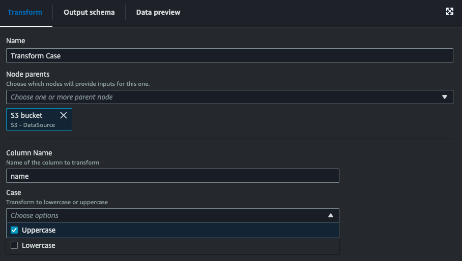

# Overview
This repo provides a starting point for a scalable solution for hosting and deploying custom Glue Studio Visual Transforms. Having a centralized repo for custom transforms allows your users to consume and deploy them to their AWS account without having to write and manage the code themselves. This way your software engineers can manage the transform code, tests, and infra structure and your analysts can consume the code without copy/pasting to reduce possible errors and ensure that updates to the transforms are applied globally across your organization automatically.

 Following the guide in this readme will show you how to:

- Build your own custom visual transforms
- Write unit tests to ensure safety of your transforms
- Use GitHub and Terraform module to deploy the transforms
- Use your new transform in Glue Studio

## Setup Environment

1. Clone this repo to your local environment
2. Activate the virtual environment using `venv`
    
    On Mac run `source venv/bin/activate`

    On Windows cmd run `venv\Scripts\activate.bat`

    On Windows PowerShell run `venv\Scripts\Activate.ps1`

3. Install the requirements
     - This repo uses Apache Spark so you make sure you have Java installed before continuing.
    - Install the Python packages by running
    `pip install -r requirements.txt` 
    - While you don't necessarily need to install Terraform locally to use this repo it could be helpful for quickly testing the vailidity of your infrastructure before applying.


## Creating Custom Transforms

There are two files that you need in order to create your custom Glue Studio Visual Transforms, a JSON config file and a Python script containing your transformation logic. You must make sure that both files share the same name (besides their extension). This is how Glue knows to associate them. To use the Terraform module to deploy the transforms you also need to have the files located in the same parent directory. For an example, see how the `case_transform` files are named. 

If you want to create additional transforms, add them in a directory like `transforms/your_new_transform/your_new_transform.json` and `transforms/your_new_transform/your_new_transform.py`.  

You can review the documentation [here](https://docs.aws.amazon.com/glue/latest/ug/custom-visual-transform-json-config-file.html) to see all the attributes you can configure to customize your transform.

### How the Transform works

The custom transform works by appending our custom transform method to the AWS Glue DynamicFrame class. This is done in the last line of our script

```python
DynamicFrame.case_transform = case_transform
```

Of course for your custom transforms you are can use the built in methods for DynamicFrames outlined [here](https://docs.aws.amazon.com/glue/latest/dg/aws-glue-api-crawler-pyspark-extensions-dynamic-frame.html), but there are visual transforms that correspond to nearly all of these in the Glue Studio UI already. Usually you are probably going to want to convert the DynamicFrame to a Spark DataFrame to get access to the lower level transform capabilities available in Spark. To convert the DynamicFrame to a DataFrame, just call `self.toDF()` like this we do in the `case_transform.py` file:

```python
df: DataFrame = self.toDF()
```

## Testing Your Transforms

This repo uses `pytest` to test the Python transformation function. You can see in the `case_transform.py` file that I have separated the transformation logic to a function that only uses the Spark API. That allows us to cleanly unit test the transformation logic without having to worry about mocking the AWS Glue DynamicFrame type. It is quite cumbersome to run code that uses those classes locally, so we are not going to unit test it. 

The method that actually gets called in the Glue job is only converting the dynamic frame to a DataFrame, passing it to the transform function, and then converting that dataframe back to a DynamicFrame. I recommend that you follow a similar pattern when developing your own custom transforms so that you can keep your unit tests simple and ensure they are rigirously testing values instead of writing weaker assertions with mocks. 

We do several parameter validation checks in our `transform` function before we actually transform any of our data, so we are going to need to write tests that assure all of those errors get raised correctly when invalid parameters are used in addition to checking the columns case gets transformed as expected.

You can run your tests with the command
```
python -m pytest --cov=transforms
```

and you can view the coverage report to see which lines of code are not covered
by running 
```
coverage report -m
```

Here's what the output should look like from the initial code:


The `Missing` column indicates which lines of code are not covered by the tests that were run. If you look at the `case_transforms.py` file you'll see that those lines are only the ones that deal with converting the DynamicFrame to a DataFrame and back, which we didn't want to test. If you did want to increase your coverage you could of course write new tests for the `case_transform` method that mocked the `DynamicFrame` class.

This repo also comes with a GitHub Action that will run the Python tests on all your pull requests before merging.


## Deploying Transforms with Terraform 

The setup to integrate Terraform with your AWS account and GitHub repo is out of scope for this readme, but if you do not already have an existing workflow with Terraform I would recommend following the setup guide [here](https://developer.hashicorp.com/terraform/tutorials/cloud-get-started) for using Terraform Cloud with the VCS workflow since it is the easiest to get started with. 

Once you have that setup, your Terraform workspace will watch your GitHub repo and automatically apply your Terraform when changes are pushed to your main branch. You can then go into your Terraform workspace and manually confirm the apply to build your resources and push the transforms to your AWS environment.

Once you have your Terraform workspace set up and connected to your AWS account you are ready to deploy custom transforms. You can see an example of using the `custom_glue_studio_transform` module for the case transform in the `main.tf` file. You can follow that example to add your own transforms by adding something like this

```terraform
module "your_new_transform_name" {
  source     = "./tf_modules/custom_glue_studio_transform/"
  region     = "your-region"
  account_id = "your-aws-account-id"
  filename   = "your_new_transform"
  local_path = "transforms/your_new_transform"
}
```

## Using Your Custom Transform in Glue Studio

Once your Terraform pipeline has successfully built and applied, you can use your new custom visual transform in Glue Studio!

Go to AWS Glue and under `ETL Jobs` on the left toolbar select `Visual ETL`. Then make sure you are in the same region you deployed your transform to, then select `Visual with a blank canvas` and click `Create` to create a new AWS Glue Studio ETL job.

Then once you have picked your data source, click the plus sign and navigate to the `Transforms` tab to pick a new transform. Scroll down and to find your new custom transform and select it.


Now input your parameters as necessary



And select your target node and then your job is ready to go! Run your job to test that it works as expected and that's it, you're set up to use custom visual transforms!
